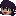
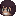

  

### 
Azumanga Daioh 64: The Knuckleheads Pack!

 
A Model Pack for SM64CoopDX and Character Select adding characters from Azumanga Daioh!

 
## Release Plans

 Our timeline of who we plan to add to the Azumanga Pack

- **Release 1** (Current Release)
    -  Osaka
    -  Tomo
    -  Kagura
- **Release 2**
    - Chiyo
    - Sakaki
    - Yomi
    - Kaorin
    - Chihiro
- **Release 3**
    - Yukari
    - Nyamo
    - Chiyo's Dad
    - *Secret Character*

## Requirements
- To Play the Mod:
   - [SM64CoopDX](https://github.com/coop-deluxe/sm64coopdx)
   - [Character Select](https://github.com/Squishy6094/character-select-coop) (v1.8 or higher)
   - [Azumanga Daioh 64 Github Repo](https://github.com/LukasATBK/char-select-azumanga-pack/releases/latest) or [Azumanga Daioh 64 SM64COOPDX Forum post](https://mods.sm64coopdx.com/mods/azumanga-daioh-64-pack.205/)(This pack!)
- To Open `.blend` files:
   - [Blender v3.6](https://www.blender.org/download/releases/3-6/)
   - [Fast64](https://github.com/Fast-64/fast64])

## Credits
- [LukasATBK](https://allmylinks.com/lukasatbk) - 3D Modelling, Project main developer
- [KasugAxel](https://twitter.com/kasugaxel) - Voice clips ripping and extra help
- [Squishy6094](https://github.com/Squishy6094) - Optimization, Outfit Selector, Github Manager
- [Nokiaa__](https://twitter.com/Nokiaa__) & [Azumadeline](https://twitter.com/azumadeline) - Osaka's Legacy model

 ## Extra
- [Discord Server](https://discord.gg/nABcj6V3m6)
- [SM64CoopDX Forums Post](https://mods.sm64coopdx.com/mods/azumanga-daioh-64-pack.205/)
- [Transparent renders, logos, HD Models, etc](https://www.mediafire.com/folder/omkm3wo4jtjm6/Azumanga64_Stuff)

